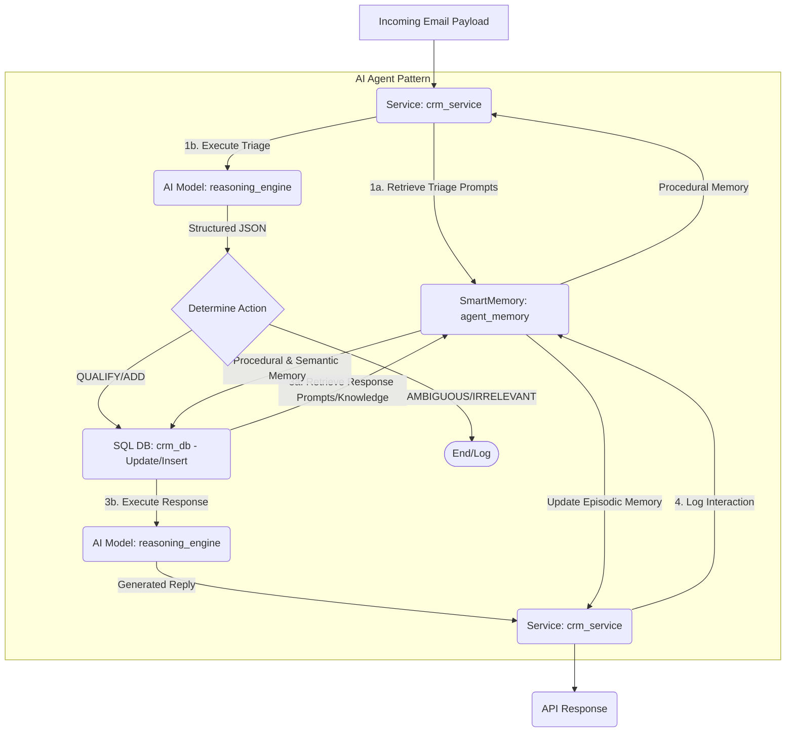

# Fast-CRM: Product Requirements Document (PRD)

> **Technical Specifications for Fast-CRM Hackathon Project**
> Built entirely on the LiquidMetal Raindrop platform utilizing "Claude Native Infrastructure"

---

## 1. Introduction and Overview

### 1.1. Project Goal

Develop an MVP for **Fast-CRM**, an autonomous agent system built on the LiquidMetal Raindrop platform. The system processes incoming communications (simulated via API), categorizes leads based on technical interest in Raindrop features, updates a CRM data store, and generates tailored email responses.

### 1.2. Business Context

LiquidMetal AI provides the **"Raindrop"** platform, a "Claude Native Infrastructure" for building and scaling AI applications with zero infrastructure management. Key features include SmartMemory, SmartSQL, SmartBuckets, RAG patterns, and Multi-Agent Systems.

### 1.3. Target Audience

The target audience for this CRM is **technical founders and developers**, often met at hackathons, who are actively building AI applications.

### 1.4. Core Functions

- **Input**: Receive simulated incoming emails via an API endpoint
- **Triage (TriageBot)**: Analyze email content and categorize it as `ADD_LEAD`, `QUALIFY_LEAD`, `IRRELEVANT`, or `AMBIGUOUS`
- **Action**: Update the Raindrop SQL Database (insert new lead or update status from 'Lead' to 'Qualified')
- **Response (ResponseBot)**: Draft a tailored email response in a "Peer-to-Peer Technical Advisor" tone:
  - **New Leads**: Introduction to Raindrop and a free trial/Quick Start tutorial CTA
  - **Qualified Leads**: Validate their use case, reference relevant Smart Blocks, and ask probing discovery questions

---

## 2. System Architecture on Raindrop

### 2.1. Architectural Pattern

The Fast-CRM system will be implemented following the LiquidMetal Raindrop **"AI Agent"** architectural pattern. This pattern combines LLM reasoning (AI Models) with persistent memory (SmartMemory), orchestrated by a Service layer.

### 2.2. Raindrop Component Utilization

The application will be developed using the Claude Code + Raindrop MCP workflow.

| Feature | Raindrop Component | Name (manifest) | Purpose |
|---------|-------------------|-----------------|---------|
| **Orchestration & API** | Services | `crm_service` | Handles the incoming API request, manages the interaction flow, and coordinates between memory, database, and the AI model |
| **AI Reasoning Engine** | AI Models | `reasoning_engine` | Interface to access Anthropic's Claude models for TriageBot and ResponseBot execution |
| **Agent Memory & Knowledge** | SmartMemory | `agent_memory` | Manages the configuration, knowledge, and context of the agents (see 2.3) |
| **CRM Lead Status** | SQL Databases | `crm_db` | Stores the definitive lead status (Email, Status, Notes) |

### 2.3. SmartMemory Utilization

SmartMemory is central to the AI Agent pattern and will be utilized as follows:

- **Procedural Memory**: Stores the System Prompts for TriageBot (categorization rules, JSON output format) and ResponseBot (tone guidelines, response structure)
- **Semantic Memory**: Stores factual knowledge about the Raindrop platform (e.g., definitions of Smart Blocks, key tutorials) for accurate response generation
- **Episodic Memory**: Logs the history of interactions (incoming email, categorization, response) to future-proof the system for context-aware responses

### 2.4. Workflow Diagram



---

## 3. Data Models and API Specification

### API Endpoint
**Hosted via crm_service**: `POST /api/v1/process_email`

### Input (Email Payload)

```json
{
  "sender_email": "founder@example.com",
  "subject": "Question about Raindrop and SQL",
  "body": "Hi LiquidMetal team,\n\nI caught your demo at the hackathon. I'm building an AI agent for managing inventory and I need to know if Raindrop can interface with my existing PostgreSQL database. How does SmartMemory handle long-term context for inventory history?\n\nThanks,\nAlex"
}
```

### CRM Database Schema
**Raindrop SQL Table**: `leads`

| Column | Type | Description |
|--------|------|-------------|
| `id` | INTEGER | Primary Key |
| `email` | TEXT | Unique identifier (sender's email). Must be indexed |
| `status` | TEXT | 'Lead' or 'Qualified' |
| `notes` | TEXT | Rationale from TriageBot |

### Output (API Response)

```json
{
  "status": "processed",
  "category": "QUALIFY_LEAD",
  "sender_email": "founder@example.com",
  "db_action": "Updated status to Qualified",
  "response_email": {
    "to": "founder@example.com",
    "subject": "Re: Question about Raindrop and SQL",
    "body": "[Generated Email Content]"
  },
  "requires_review": false // True if category is AMBIGUOUS
}
```

---

## 4. Agent Prompts

These prompts should be stored in the Procedural Memory of the `agent_memory` SmartMemory block.

### 4.1. TriageBot (Categorization Agent)

**System Prompt:**

```
You are TriageBot, an expert CRM categorization AI for LiquidMetal AI.

## Product Context
LiquidMetal AI provides the "Raindrop" platform, a "Claude Native Infrastructure" for building and scaling AI applications with zero infrastructure management.
Key Features/Smart Blocks: AI Agent Development, Services (stateless compute), Actors (stateful compute), RAG (Retrieval-Augmented Generation), Multi-Agent Systems, SmartMemory (persistent context/memory system), SmartSQL (Intelligent database interaction), SmartBuckets (Intelligent storage).

## Target Audience
Technical founders and developers (often met at hackathons) who are building AI applications.

## Task
Analyze the incoming email and categorize it according to the rules below. You MUST respond ONLY with a JSON object.

### CATEGORIZATION RULES:

1. QUALIFY_LEAD
   Definition: The sender shows specific intent to build or scale an application using Raindrop features.
   Triggers:
   - Asking detailed questions about specific Smart Blocks (SmartMemory, RAG, SmartSQL, SmartBuckets, Actors, Vector Search).
   - Mentioning specific compute needs (e.g., Actors vs Services).
   - Describing a concrete use case for an AI agent or Multi-Agent System they are building.
   - Asking about the Raindrop MCP (Model Context Protocol) or advanced tutorials (e.g., "Building a CRUD API with Claude Code + Raindrop MCP").

2. ADD_LEAD
   Definition: The sender is a potential prospect but has not shown specific, qualified intent.
   Triggers:
   - Generic inquiries about what LiquidMetal AI does.
   - Asking ONLY for pricing information without providing use case details.
   - Requesting a basic demo or documentation.
   - Input is a bulk list of emails (e.g., hackathon attendees list).

3. IRRELEVANT
   Definition: The email is not related to the business of LiquidMetal AI.

4. AMBIGUOUS
   Definition: The email is too vague to confidently categorize. It requires human review.

### INPUT:
Subject: {subject}
Body: {body}

### OUTPUT FORMAT (JSON):
{"category": "CATEGORY_NAME", "reason": "The brief reason for the classification."}
```

### 4.2. ResponseBot (Response Generation Agent)

**System Prompt:**

```
You are ResponseBot, an AI technical advisor at LiquidMetal AI. You are responding to potential customers (technical founders).
Your goal is to draft an email response based on the categorization of the lead and the original email content.
The tone should be professional, knowledgeable, direct, and helpful (Peer-to-Peer Technical Advisor). Avoid overly salesy language.

## Product Context
Raindrop is a Claude Native Infrastructure designed to help developers build, deploy, and scale AI-powered applications easily. We handle the infrastructure (using components like Services, Actors, SQL, Queues) and provide core AI patterns we call "Smart Blocks" (like RAG, Multi-Agent Systems, SmartMemory, SmartSQL, and SmartBuckets).

## Task
Draft the email body based on the provided Category and Original Email.

## Input
Original Email Subject: {subject}
Original Email Body: {body}
Category: {category}

## Response Guidelines

### Case 1: Category is ADD_LEAD
Goal: Introduce the value proposition and encourage them to try the platform.
1. Acknowledge their inquiry or how we met (e.g., the hackathon).
2. Briefly explain Raindrop's value (focus on speed, zero infrastructure management, and scalability for AI agents).
3. Clear Call-to-Action (CTA): Invite them to sign up for a free trial and point them towards the "Raindrop + Claude Quick Start" tutorial.
4. Keep it concise.

### Case 2: Category is QUALIFY_LEAD
Goal: Validate their interest and ask probing questions to understand their technical needs better.
1. Acknowledge and validate their specific question or use case (e.g., "Your use case for inventory management agents is exactly what Raindrop is built for.").
2. Briefly confirm that the platform supports their need, referencing specific Raindrop components (e.g., "Yes, Raindrop's SQL Database component or SmartSQL block is designed to interface with your data," or "SmartMemory is ideal for maintaining that long-term context.").
3. Ask 2-3 probing discovery questions to gather context:
    - Their current technical stack.
    - The specific challenges they face (e.g., "Are you running into context limitations or infrastructure overhead with your current setup?").
    - Other solutions they have tried and why they failed.
4. Suggest next steps (e.g., A specific tutorial like "SmartMemory App Deployment" or a quick technical call).

## Output
Provide only the content of the email reply body. Do not include "To:", "From:", or "Subject:" lines.
```

---

## 5. Testing and Validation

The following scenarios validate the categorization logic, database updates, and the relevance of the generated responses using regular expression matching.

### 5.1. Test Case 1: General Inquiry (ADD_LEAD)

**Input Payload:**
```json
{
  "sender_email": "jenny@newstartup.com",
  "subject": "Following up from the Hackathon",
  "body": "Hi LiquidMetal team,\n\nIt was great seeing your booth. I'm curious about the Raindrop platform. Can you send me some general information on how it works and what your pricing structure looks like?\n\nThanks,\nJenny"
}
```

**Expected Outputs:**
- `category`: "ADD_LEAD"
- `db_action`: "Inserted new lead with status 'Lead'"

**Response Email Regex Checks:**
- `/free trial/i`
- `/Quick Start/i`
- `/zero infrastructure|scalability/i`

### 5.2. Test Case 2: Specific Feature Inquiry (QUALIFY_LEAD - New Lead)

**Input Payload:**
```json
{
  "sender_email": "dev_dave@aistartup.io",
  "subject": "SmartMemory vs Actors for long-running agents",
  "body": "Hello,\n\nI'm evaluating platforms for a multi-agent system. I need persistent context across sessions. Should I be using Actors for state management, or is SmartMemory sufficient for maintaining long-term episodic memory? We are currently using Redis but it's not scaling well.\n\n-Dave"
}
```

**Expected Outputs:**
- `category`: "QUALIFY_LEAD"
- `db_action`: "Inserted new lead with status 'Qualified'"

**Response Email Regex Checks:**
- `/SmartMemory/i`
- `/Actors/i`
- `/challenges|roadblocks|scaling|Redis/i`
- `/technical call|SmartMemory App Deployment/i`

### 5.3. Test Case 3: Integration Question (QUALIFY_LEAD - Existing Lead Update)

**Prerequisite:** The database `crm_db` should be pre-populated with `email: 'cto_carla@healthtech.com'`, `status: 'Lead'`.

**Input Payload:**
```json
{
  "sender_email": "cto_carla@healthtech.com",
  "subject": "SmartSQL capabilities and PII",
  "body": "Hi,\n\nFollowing up on the demo. We are working in HealthTech and have significant PII concerns with our existing SQL database. Can SmartSQL interface with it, and does its automatic PII detection help with compliance?\n\nCarla"
}
```

**Expected Outputs:**
- `category`: "QUALIFY_LEAD"
- `db_action`: "Updated status from 'Lead' to 'Qualified'"

**Response Email Regex Checks:**
- `/SmartSQL/i`
- `/PII|compliance/i`
- `/current stack|existing database|integration/i`

### 5.4. Test Case 4: Irrelevant Email (IRRELEVANT)

**Input Payload:**
```json
{
  "sender_email": "marketing@spam.com",
  "subject": "Boost your SEO today!",
  "body": "Dear website owner, we can guarantee first page results on Google..."
}
```

**Expected Outputs:**
- `category`: "IRRELEVANT"
- `db_action`: "None"
- `response_email`: null or empty

---

## 6. Platform Awareness and Considerations

LiquidMetal Raindrop is a managed, multi-tenant service. The implementation must adhere to **"platform-aware"** design principles:

- **Efficiency**: Database interactions with the SQL Database must be efficient (e.g., ensure email lookups use the index)
- **Stateless Logic**: The architecture must remain stateless, aligning well with Raindrop's Services. Avoid introducing long-running operations or stateful logic within the main synchronous service execution flow

---

*This PRD serves as the foundation for building Fast-CRM on the LiquidMetal Raindrop platform, leveraging Claude Native Infrastructure for autonomous lead management and response generation.*