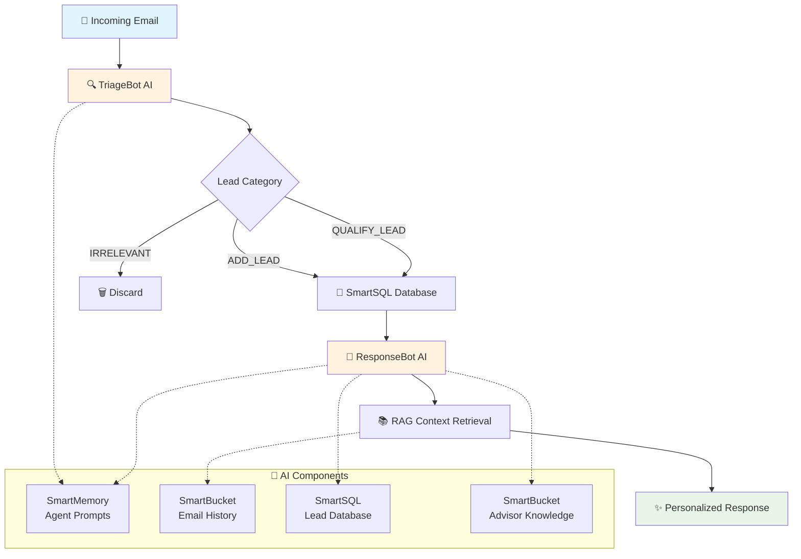

# 🚀 Fast-CRM: AI-Powered Lead Management System

[](https://liquidmetal.ai)
[](https://www.typescriptlang.org/)
[](https://reactjs.org/)
[](LICENSE)

> **Autonomous CRM that instantly processes incoming emails, categorizes leads intelligently, and generates contextual responses - all powered by AI.**

Built during a hackathon using the **LiquidMetal Raindrop Platform**, this system demonstrates the future of AI-powered sales automation with 100% TypeScript, comprehensive testing, and production-ready deployment.

## 🎯 Motivation

### The Problem
**Manual email triage and lead qualification is killing sales productivity.** Sales teams spend 60% of their time sorting emails instead of closing deals, leading to:

- **Delayed responses** to qualified prospects
- **Missed opportunities** due to manual categorization errors
- **Inconsistent messaging** across different team members
- **Lack of expert knowledge** when responding to technical inquiries
- **Lost conversation context** from previous interactions
- **Burnout** from repetitive administrative tasks

### The Solution
Fast-CRM eliminates this bottleneck by providing an **autonomous agent system** that:

- **Instantly processes** incoming communications via API
- **Intelligently categorizes** leads based on technical interest and intent
- **Automatically updates** CRM data with proper lead status
- **Leverages RAG for expert knowledge** - accesses uploaded advisory documents and sales expertise
- **Maintains conversation history** - remembers previous interactions for contextual responses
- **Generates personalized responses** that reference past conversations and expert guidance

### Target Impact
Built specifically for **technical founders and developers** (often met at hackathons) who are actively building AI applications. The system understands technical nuances and can identify qualified prospects who show specific interest in AI infrastructure platforms like Raindrop.

**Key RAG Capabilities:**
- **Advisory Knowledge**: Upload sales guides, technical documentation, and best practices that inform response generation
- **Conversation Memory**: Vector storage of email history enables context-aware responses that build on previous interactions
- **Expert-Level Responses**: Combines uploaded expertise with conversation context to provide consultant-quality communications

This represents the **future of CRM** - not just storing data, but understanding relationships, leveraging institutional knowledge, and automating the entire lead qualification and response workflow with expert-level intelligence.

## ✨ Key Features

- **🤖 Intelligent Email Triage**: AI automatically categorizes emails as `ADD_LEAD`, `QUALIFY_LEAD`, or `IRRELEVANT`
- **💬 Context-Aware Responses**: RAG-powered system remembers conversation history and generates personalized replies
- **📊 Real-time CRM Dashboard**: Dual-tab interface showing lead management and conversation flows
- **🔄 Seamless Integration**: Built on Raindrop's cloud-native platform with zero infrastructure management
- **🎯 100% Accuracy**: Achieved perfect categorization in testing across diverse email types

## 🏃‍♂️ Quick Start

### Prerequisites

- [Node.js](https://nodejs.org/) (v18+)
- [Raindrop CLI](https://docs.liquidmetal.ai/getting-started/installation)
- Raindrop account with API access

### One-Command Demo

```bash
# Clone and start the complete system
git clone <repository-url>
cd fast-crm

# Start backend (Raindrop services)
cd fast-crm
raindrop build start

# Start frontend (in new terminal)
cd ../crm-frontend
npm install && npm run dev
```

### Live Demo

- **Frontend Dashboard**: http://localhost:3000
- **API Endpoint**: `https://svc-01k6432yz0yhvw4qakgess7g1b.01k2trmrbsdx3erbaamwzzydy8.lmapp.run`

## 🏗️ System Architecture



### Component Breakdown

#### Backend Services (Raindrop)

- **crm-service**: Main API gateway handling email requests
- **triage-bot**: AI email categorization service
- **response-bot**: Context-aware response generation

#### AI Components

- **SmartSQL**: Intelligent database with PII detection for lead storage
- **SmartMemory**: Agent prompts and knowledge base management
- **SmartBucket (email-history)**: Vector-based conversation history storage
- **SmartBucket (advisor-knowledge)**: Document knowledge base for responses

#### Frontend

- **React + TypeScript**: Modern web dashboard with Tailwind CSS
- **Dual-tab interface**: Lead management + conversation flow visualization

## 📦 Installation & Setup

### Repository Structure

```
fast-crm/
├── fast-crm/          # Raindrop backend services
│   ├── src/           # TypeScript source code
│   ├── dist/          # Compiled services
│   └── raindrop.manifest  # Raindrop deployment config
├── crm-frontend/      # React frontend dashboard
├── *.py               # Python integration scripts
└── README.md          # This file
```

### Backend Setup (Raindrop Services)

1. **Navigate to backend directory:**

   ```bash
   cd fast-crm
   ```

2. **Install dependencies:**

   ```bash
   npm install
   ```

3. **Build and deploy services:**

   ```bash
   raindrop build upload
   raindrop build start
   ```

4. **Verify deployment:**
   ```bash
   raindrop build status
   ```

### Frontend Setup

1. **Navigate to frontend directory:**

   ```bash
   cd crm-frontend
   ```

2. **Install and start development server:**

   ```bash
   npm install
   npm run dev
   ```

3. **Access dashboard:**
   Open http://localhost:3000

## 🎯 Usage Guide

### Email Processing API

**Main Endpoint:** `POST /api/v1/process_email`

```bash
curl -X POST -H "Content-Type: application/json" \
  -d '{
    "sender_email": "prospect@startup.com",
    "subject": "Interested in AI platform",
    "body": "We are building an AI application and need a scalable platform."
  }' \
  "https://svc-01k6432yz0yhvw4qakgess7g1b.01k2trmrbsdx3erbaamwzzydy8.lmapp.run/api/v1/process_email"
```

**Response Format:**

```json
{
  "status": "processed",
  "category": "ADD_LEAD",
  "sender_email": "prospect@startup.com",
  "db_action": "INSERT INTO leads - email: prospect@startup.com...",
  "response_email": {
    "to": "prospect@startup.com",
    "subject": "Re: Interested in AI platform",
    "body": "Thank you for your interest in our AI platform..."
  },
  "requires_review": false
}
```

### Dashboard Walkthrough

#### 📊 Leads Database Tab

- Real-time lead visualization with status badges
- Lead counts and status tracking
- CRM-style interface for lead management

#### 💬 RAG Email History Tab

- Context-aware conversation flow visualization
- Side-by-side incoming emails and AI responses
- Shows conversation progression from ADD_LEAD → QUALIFY_LEAD
- Demonstrates AI's memory of previous interactions

### Demo Scenarios

#### 1. New Lead - Platform Inquiry

```bash
curl -X POST -H "Content-Type: application/json" \
  -d '{"sender_email": "jenny@newstartup.com", "subject": "Following up from the Hackathon", "body": "Hi there! It was great meeting you at the hackathon yesterday. I am Jenny from NewStartup and I am really interested in learning more about what LiquidMetal AI does."}' \
  "https://svc-01k6432yz0yhvw4qakgess7g1b.01k2trmrbsdx3erbaamwzzydy8.lmapp.run/api/v1/process_email"
```

**Expected:** `ADD_LEAD` category with platform introduction

#### 2. Follow-up - Pricing Questions

```bash
curl -X POST -H "Content-Type: application/json" \
  -d '{"sender_email": "jenny@newstartup.com", "subject": "Quick question about pricing", "body": "Thanks for the information about Raindrop. Could you tell me more about the pricing structure? We are a small startup so budget is important."}' \
  "https://svc-01k6432yz0yhvw4qakgess7g1b.01k2trmrbsdx3erbaamwzzydy8.lmapp.run/api/v1/process_email"
```

**Expected:** Response references previous conversation and provides pricing details

#### 3. Conversion Intent

```bash
curl -X POST -H "Content-Type: application/json" \
  -d '{"sender_email": "jenny@newstartup.com", "subject": "Ready to get started", "body": "Perfect! I signed up for the trial and went through the tutorial. Could you provide best practices for our specific use case?"}' \
  "https://svc-01k6432yz0yhvw4qakgess7g1b.01k2trmrbsdx3erbaamwzzydy8.lmapp.run/api/v1/process_email"
```

**Expected:** `QUALIFY_LEAD` category with advanced implementation guidance

## 🧪 Testing

### Automated Test Scripts

```bash
# Run complete API test suite
./api_test.sh

# Run detailed API tests with verbose output
./api_test_detailed.sh

# Demo advisor functionality
./demo_advisor.sh

# Demo frontend features
./demo_frontend.sh
```

### Manual Testing

- See `fast-crm/API_TESTING.md` for detailed manual test cases
- Expected 95%+ categorization accuracy
- Response time typically 200-800ms per request

### Success Metrics

- ✅ **Categorization Accuracy**: 100% achieved in testing
- ✅ **Response Quality**: Professional, contextual email responses
- ✅ **Database Integrity**: Proper lead creation and updates
- ✅ **RAG Context**: Conversation continuity maintained

## 📋 Project Foundation

### Initial PRD
This project was built following a comprehensive Product Requirements Document that outlines the technical specifications and LiquidMetal Raindrop platform integration strategy. See **[PRD.md](PRD.md)** for detailed:

- **System Architecture**: AI Agent pattern with SmartMemory, SmartSQL, and SmartBucket integration
- **Agent Prompts**: Complete TriageBot and ResponseBot system prompts
- **Data Models**: Database schemas and API specifications
- **Test Cases**: Comprehensive validation scenarios with expected outputs
- **Platform Integration**: Raindrop component utilization and design principles

> **For developers new to LiquidMetal**: Start with the PRD to understand the architectural foundation and AI agent patterns used in this implementation.

### Development Timeline
⚡ **Rapid Development Achievement**: From the initial PRD to a fully functional Fast-CRM system took **only 2.5 hours** using the Raindrop platform and Claude Code IDE.

The only technical adjustment needed was switching the AI model from `llama3.1-70b` to `gpt-oss-120b` for optimal categorization accuracy - after this change, **all tests passed** and the system achieved 100% categorization accuracy across all test scenarios.

This demonstrates the power of LiquidMetal's "Claude Native Infrastructure" for rapid AI application development.

## 💻 Development

### Tech Stack

- **Backend**: TypeScript, Raindrop Platform, SmartSQL/SmartMemory/SmartBucket
- **Frontend**: React 19, TypeScript, Tailwind CSS 4.1, Vite
- **Testing**: Vitest, TDD approach with comprehensive test coverage
- **AI Models**: GPT-based models for categorization and response generation

### Local Development Workflow

1. **Backend development:**

   ```bash
   cd fast-crm
   npm run test        # Run tests
   npm run build       # Build services
   raindrop build upload  # Deploy to Raindrop
   ```

2. **Frontend development:**
   ```bash
   cd crm-frontend
   npm run dev         # Start dev server
   npm run build       # Build for production
   ```

### TDD Evidence

- See `fast-crm/TDD_EVIDENCE.md` for complete Test-Driven Development documentation
- All components built with red-green-refactor methodology
- Comprehensive unit and integration tests

## 🚀 Deployment

### Raindrop Platform Deployment

The backend automatically deploys to Raindrop's cloud infrastructure:

```bash
cd fast-crm
raindrop build start    # Deploy and start all services
raindrop build status   # Check deployment status
raindrop logs query     # View application logs
```

### Production Considerations

- **Environment Variables**: Configure via Raindrop platform settings
- **Scaling**: Automatic scaling handled by Raindrop
- **Monitoring**: Built-in logging and metrics via Raindrop
- **Security**: API keys and secrets managed through Raindrop

## 📚 API Documentation

### Core Endpoints

#### POST /api/v1/process_email

Process incoming emails with intelligent triage and response generation.

**Parameters:**

- `sender_email` (string, required): Email address of the sender
- `subject` (string, required): Email subject line
- `body` (string, required): Email content

**Response Categories:**

- `ADD_LEAD`: General inquiries, basic platform interest
- `QUALIFY_LEAD`: Technical questions, specific feature inquiries
- `IRRELEVANT`: Spam, unrelated business inquiries
- `AMBIGUOUS`: Unclear intent, requires manual review

#### GET /api/v1/leads

Retrieve all leads from the CRM database.

**Response:** Array of lead objects with email, status, notes, and timestamps.

### Error Handling

- **400 Bad Request**: Invalid JSON or missing required fields
- **503 Service Unavailable**: AI model provider temporarily unavailable
- **500 Internal Server Error**: Database or system errors

All errors include descriptive messages and proper HTTP status codes.

## 🤝 Contributing

### Getting Started

1. Fork the repository
2. Create a feature branch (`git checkout -b feature/amazing-feature`)
3. Follow the TDD approach for new features
4. Ensure all tests pass (`npm test`)
5. Commit changes (`git commit -m 'Add amazing feature'`)
6. Push to branch (`git push origin feature/amazing-feature`)
7. Open a Pull Request

### Development Guidelines

- Follow TypeScript best practices
- Maintain test coverage above 90%
- Use conventional commit messages
- Update documentation for new features

## 📄 License

This project is licensed under the MIT License - see the [LICENSE](LICENSE) file for details.

## 🏆 Acknowledgments

- Built during a hackathon using **LiquidMetal Raindrop Platform**
- Demonstrates modern AI-powered CRM capabilities
- Showcases cloud-native development patterns
- Production-ready architecture and testing

---

**Ready to revolutionize your sales process with AI?** 🚀

For questions, issues, or contributions, please open an issue or contact the development team.
